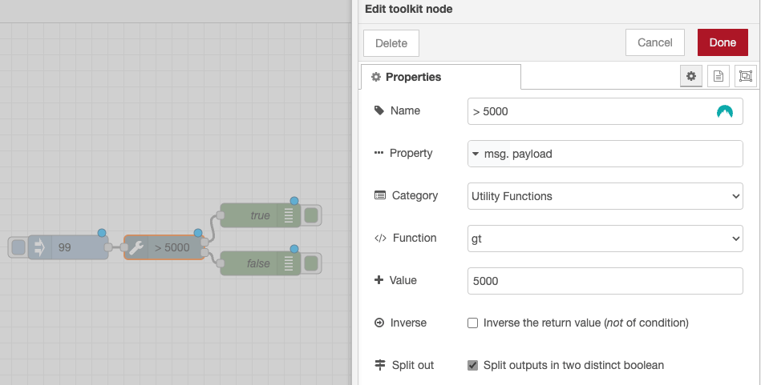

# node-red-contrib-ultimate-toolkit

A collection of utilities to help you build your Node-RED flows.

 

  

    
    
    
    

  
  

## Overview

This package provides a set of utilities to help you build your Node-RED flows.

Convert, format, and manipulate your data with ease.

Essentially based on [es-toolkit](https://es-toolkit.slash.page/) and [radash](https://radash-docs.vercel.app/docs/getting-started)

If native Node.js are available, they are used instead of the libraries.

**One node to rule them all!**

## Features

### Array Utilities

- `Group By`
- `Key By`
- `Shuffle`
- `Sum`
- `Take`
- `Take Right`
- `Toggle`
- `Unique`

### Async Utilities

- `Delay`

### Date Utilities

- `Current Timezone`
- `Now`

### Math Utilities

- `Abs`
- `Acos`
- `Asin`
- `Atan`
- `Ceil`
- `Cos`
- `Exp`
- `Floor`
- `Log`
- `Max`
- `Mean`
- `Median`
- `Min`
- `Random`
- `Round`
- `Sin`
- `Sum`
- `Tan`
- `Trunc`

### Network Utilities

- `Ip Information`
- `Ip Version`
- `Network Interfaces`

### Object Utilities

- `Get Keys`

### Predicates

- `Is Boolean`
- `Is Buffer`
- `Is Ip`
- `Is NaN`
- `Is Nil`
- `Is Null`
- `Is Number`
- `Is String`
- `Is Undefined`
- `Is Url`

### String Utilities

- `Camel Case`
- `Capitalize`
- `Constant Case`
- `Escape`
- `Kebab Case`
- `Lower Case`
- `Lower First`
- `Pascal Case`
- `Snake Case`
- `Start Case`
- `Trim`
- `Trim End`
- `Trim Start`
- `Unescape`
- `Upper Case`
- `Upper First`
- `Words`

### Utility Functions

- `Eq`
- `Gt`
- `Gte`
- `Lt`
- `Lte`
- `Size`
- `To Boolean`
- `To Boolean Number`
- `To Number`
- `To Safe Integer`
- `To String`
- `toNumber (non-strict)`

## Performance

All used libraries are treeshaked and included in the final bundle. 

**No extra dependencies are added**

[Very small distribution](https://www.npmjs.com/package/@keload/node-red-contrib-ultimate-toolkit?activeTab=code) size < 30kb.

## Contributing

This package use [node-red-dxp](https://www.npmjs.com/package/@keload/node-red-dxp) to build the package.
A crazy fast and easy way to build Node-RED package.

Please feel free to contribute to this package by creating issues or pull requests.

## License

MIT
