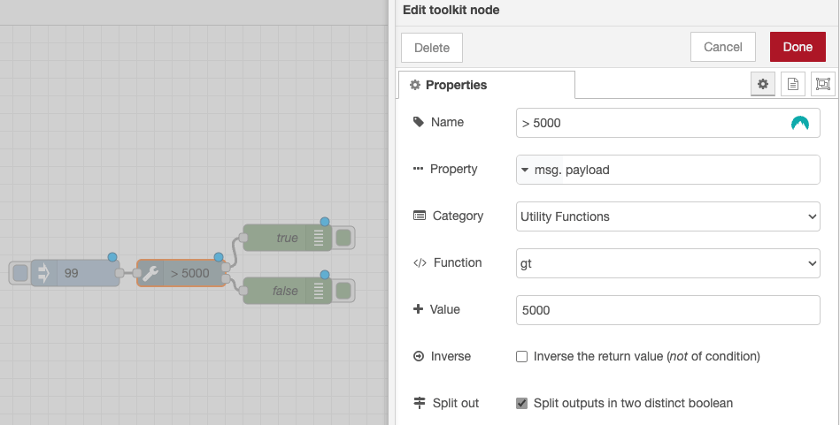

# node-red-contrib-ultimate-toolkit

<h3 align="center">The multi-tool for Node-RED, all in one lightweight node.</h3>

<br/>
<p align="center">
  <a href="https://www.npmjs.com/package/@keload/node-red-dxp" aria-label="Build with node-red-dxp">
    
  </a>
</p>
<p align="center">
    <a href="https://github.com/clement-berard/node-red-contrib-ultimate-toolkit/graphs/contributors">
        
    </a>
    <a href="https://github.com/clement-berard/node-red-contrib-ultimate-toolkit/network/members">
        
    </a>
    <a href="https://github.com/clement-berard/node-red-contrib-ultimate-toolkit/stargazers">
        
    </a>
    <a href="https://github.com/clement-berard/node-red-contrib-ultimate-toolkit/issues">
        
    </a>
</p>
<p align="center">
  <a aria-label="NPM Version" href="https://www.npmjs.com/package/@keload/node-red-contrib-ultimate-toolkit">
    
  </a>
  <a aria-label="NPM Download Count" href="https://www.npmjs.com/package/@keload/node-red-contrib-ultimate-toolkit">
    
  </a>
</p>
<table align="center">
  <tr>
    <td align="center">
      <h2>✨ 76</h2>
      <sub><b>Built-in Utilities</b></sub>
    </td>
    <td align="center">
      <h2>🍃 0</h2>
      <sub><b>Runtime Dependencies</b></sub>
    </td>
    <td align="center">
      <h2>🚀 54 kB</h2>
      <sub><b>Bundle Size</b></sub>
    </td>
  </tr>
</table>

## Overview 🔦

✨ Simplify and optimize your Node-RED flows with this versatile package! ✨

Effortlessly handle date formatting, math operations, data manipulation, and more—all **in a single node.**

When needed, the following libraries were used sparingly:
- [es-toolkit](https://es-toolkit.slash.page/)
- [radash](https://radash-docs.vercel.app/docs/getting-started)
- [tempo](https://tempo.formkit.com/)

Whenever possible, native Node.js methods take precedence for maximum efficiency.

**One node to rule them all—streamline your flows like never before!**



## Installation 📦

```bash
npm install @keload/node-red-contrib-ultimate-toolkit
```

You can also install it directly from the Node-RED editor via **Manage Palette**.

## Performance 🚀

All used libraries are treeshaked and included in the final bundle.

**No extra dependencies are added.**

## Features ✨


### → Array Utilities

`Get Random Item` · `Group By` · `Key By` · `Shuffle` · `Take` · `Take Right` · `Toggle` · `Unique`

### → Async Utilities

| Name | Description |
| --- | --- |
| `Delay` | Delays the message by the specified amount of time |

### → Date Utilities

| Name | Description |
| --- | --- |
| `Current Timezone` | Returns the current timezone |
| `Format` | Return formatted date from a date |
| `Now` | Returns the current date with lot of formatting options |
| `Time Range` | Routes messages depending on the time |

### → Math Utilities

`Abs` · `Acos` · `Asin` · `Atan` · `Ceil` · `Cos` · `Exp` · `Floor` · `Log` · `Max` · `Mean` · `Median` · `Min` · `Random` · `Round` · `Sin` · `Sum` · `Tan` · `Trunc`

### → Network Utilities

| Name | Description |
| --- | --- |
| `Ip Information` | Fetches detailed information about an IP address |
| `Ip Version` | Returns IP version (4, 6, or 0 if invalid) for a given IP address string |
| `Network Interfaces` | Lists all network interfaces of the current machine (ethernet, wifi, etc.) |

### → Object Utilities

`Get Keys`

### → Predicates

`Is Boolean` · `Is Buffer` · `Is Ip` · `Is Na N` · `Is Nil` · `Is Null` · `Is Number` · `Is String` · `Is Undefined` · `Is Url`

### → String Utilities

`Camel Case` · `Capitalize` · `Constant Case` · `Escape` · `Kebab Case` · `Lower Case` · `Lower First` · `Pascal Case` · `Snake Case` · `Start Case` · `Trim` · `Trim End` · `Trim Start` · `Unescape` · `Upper Case` · `Upper First` · `Words`

### → Tools

| Name | Description |
| --- | --- |
| `Cyclic Counter` | A customizable cyclic counter node for Node-RED that iterates through a defined sequence of numbers and can reset after a set timeout. It allows flexible control over the counter's behavior, making it useful in a variety of automation scenarios. |

### → Utility Functions

`Eq` · `Gt` · `Gte` · `Lt` · `Lte` · `Size` · `To Boolean` · `To Boolean Number` · `To Number` · `To Number Non Strict` · `To Safe Integer` · `To String`


## Contributing & Developer Experience
This package is built using [node-red-dxp](https://www.npmjs.com/package/@keload/node-red-dxp), offering a blazing-fast and seamless way to develop Node-RED packages. 

Written in **TypeScript**, the codebase is cleanly structured, ensuring maintainability and effortless scalability.

We’re committed to keeping this node alive and thriving, making it a joy to evolve and improve over time. Whether it's refining existing features or adding new capabilities, contributing should always be an enjoyable experience.

Feel free to join the journey—create issues, submit pull requests, or share your ideas. Let’s build something incredible together!

## License

MIT
